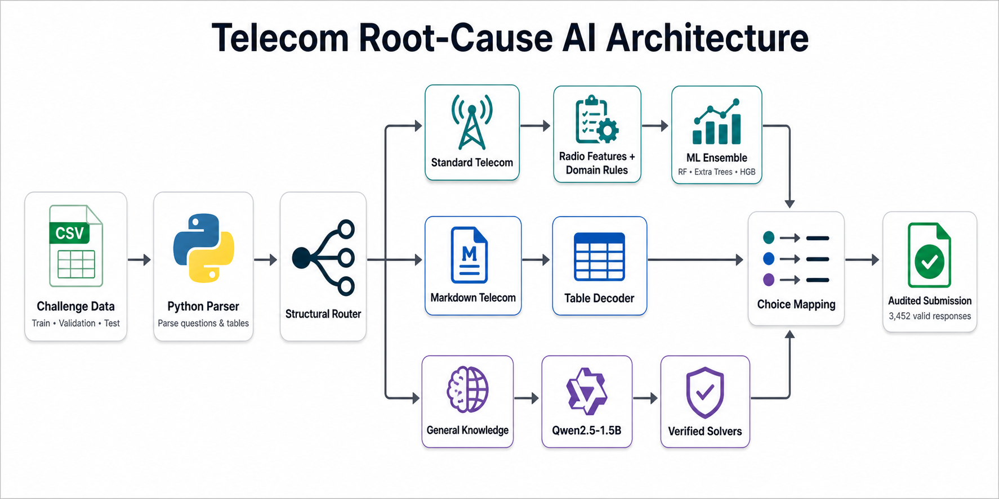

# Telecom Root-Cause AI

This is my open-source solution for the [Cassava AI Root Cause Detective Hackathon](https://zindi.africa/competitions/cassava-ai-root-cause-detective-hackathon).

The challenge was about using AI and telecom network data to understand **why network problems happen**. Instead of only detecting that a BTS or cell is performing badly, the goal was to identify the most likely root cause behind the problem.

My final solution ranked **4th out of 67 active participants**, with a **0.98344 private leaderboard score after seven submissions**.

## How it works

The system looks at different types of telecom network information, including throughput, resource-block utilization, handovers, serving distance, antenna configuration, neighboring-cell signals, overlap, and PCI information.

It combines several approaches:

- Telecom engineering rules
- Feature engineering
- Classical machine-learning models
- A small local language model
- Deterministic checks and verification

Using this information, the system tries to determine the most likely explanation for a network problem.

Depending on the data, it can identify scenarios related to:

- Weak coverage
- Interference
- Network congestion
- Handover problems
- Antenna configuration
- Missing neighbors
- PCI conflicts
- Transport failures

## Architecture



The project uses different processing paths depending on the type and structure of the question. The outputs are then checked and mapped to the final root-cause prediction.

## Why I made it open source

After the competition, some telecom engineers and other people interested in the project asked me about the model and how the solution worked.

Instead of keeping the work on my computer, I decided to clean it up, document it, and make it public.

I hope telecom engineers, students, researchers, and people interested in AI can use this repository to understand the approach, experiment with it, improve it, or build something new from it.

This is not a production telecom network-management system. Every operator has different equipment, KPIs, configurations, and network conditions. Using this approach on a real network would require testing and validation with that operator's own data.

## Getting started

```bash
git clone https://github.com/iamismaill/telecom-root-cause-ai.git
cd telecom-root-cause-ai

python -m venv .venv
source .venv/bin/activate

pip install -r requirements.txt
pytest -q

## Contributing

Corrections, tests, documentation improvements, and new research experiments are welcome. Please read [CONTRIBUTING.md](CONTRIBUTING.md) before opening a pull request.

## Citation

If you use this work in research, please cite it using [CITATION.cff](CITATION.cff).
